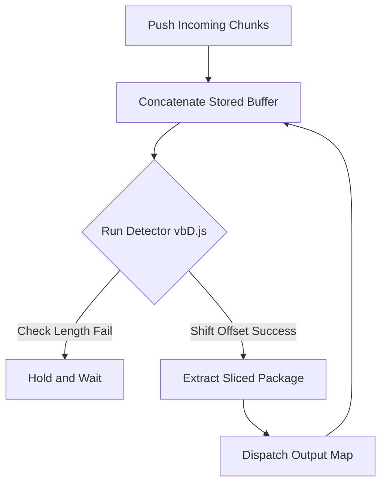

# @talkto-me/stream : Binary Network Stream Parsing Framework

## Table of Contents

- [Features](#features)
- [Demo](#demo)
- [Design Concept](#design-concept)
- [Tech Stack](#tech-stack)
- [Structure](#structure)
- [History](#history)

## Features

Extract fractured binary payloads and rebuild discrete data frames steadily via pure transformation piping.

## Demo

Expose frame chunks from raw reader pipes:

```javascript
import unframe from "@talkto-me/stream/unframe.js";
/* Mount decoder into response flow stream */
const reader = res.body.pipeThrough(unframe()).getReader();
const { value, done } = await reader.read();
/* Exposes sliced type and origin bytes Array */
```

## Design Concept

Maintain cumulative byte lists temporarily, calculate boundary index dynamically using shifted-MSB strategy, and safely slice payload objects recurrently.



## Tech Stack

JavaScript, TransformStream, Uint8Array.

## Structure

- `unframe.js`: Primary framing pipe transformer logic
- `vbD.js`: Underlying MSB variant digits calculator

## History

Variant variable encoding method originated and shines vastly via early protocol-buffers specifications. Deciding continuous limits via MSB strictly prevented zero-fill wastes in basic network payloads over decades.
