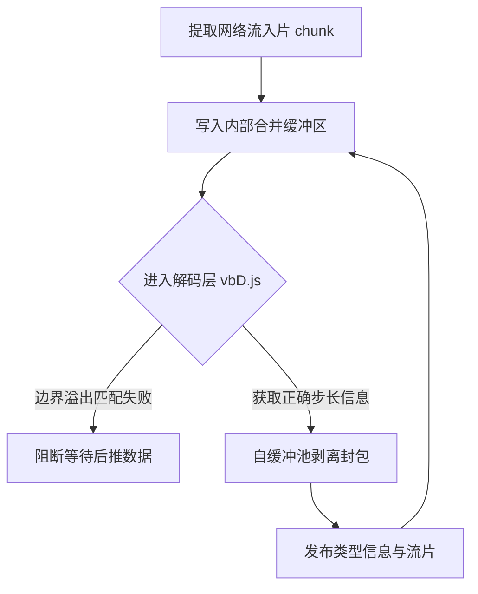

# @talkto-me/stream : 二进制网络流解包框架

## 目录

- [功能](#功能)
- [使用演示](#使用演示)
- [设计思路](#设计思路)
- [技术堆栈](#技术堆栈)
- [目录结构](#目录结构)
- [历史故事](#历史故事)

## 功能

承接散装网络数据，利用变长解解码拆装报文并封装原生推拉流。

## 使用演示

结合 Web API使用：

```javascript
import unframe from "@talkto-me/stream/unframe.js";
/* 对下路长链接推送结果执行数据剥离与复原 */
const reader = res.body.pipeThrough(unframe()).getReader();
const { value, done } = await reader.read();
/* 输出包含 type 以及 Uint8Array 类型 data */
```

## 设计思路

内部使用缓存流暂存合并跨信道不完整推流，借助变长规则测长；判定成功则切段输出。



## 技术堆栈

JavaScript, TransformStream, Uint8Array.

## 目录结构

- `unframe.js`: 拆包通道转换流主逻辑
- `vbD.js`: 底层 vbyte 类型变长位数探测提取代码

## 历史故事

变宽整形压缩（Varint）广泛应用于古老到当代的顶级序列化引擎（如 Protobuf），通过提取字节里 MSB 最高位的掩码去指示数据连贯性结束与否。这套法则用少量代码和极端节省的底层通讯流量大幅改善了宽带紧缺年代网络堵塞的问题。
